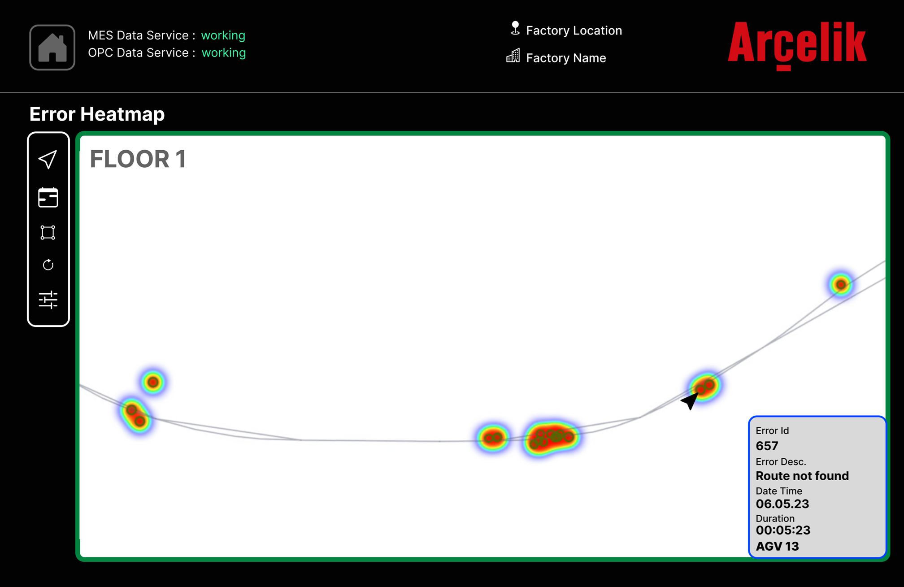

## Project

- **Name:** AGV Report System
- **Customer:** Ulker Biscuit Factory (Kocaeli), Arcelik Washing Machine Factory (Ankara), Arcelik Cooking Appliances Factory (Bolu)

## Technologies Used

- **Backend:** C# ASP.NET MVC 
- **Communications:** Manufactoring Execution System (MES) via TCP/IP + Error commmunication via OPC UA
- **Frontend:** Bootstrap5 (UI framework)  
- **Database:** Microsoft SQL Server 2019 (MSSQL 19)  
- **Version Control / CI/CD:** GitHub

## Team

- Developed by a **1-person team**: 1 developer
- **Development Duration:** 2 years

## Screenshots

